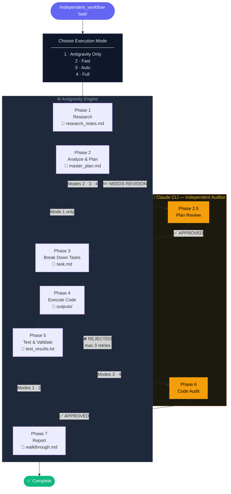

# Independent AI Workflow Orchestrator

A fully autonomous, self-correcting multi-agent software development workflow powered by **Antigravity IDE** + **Claude CLI** as an independent auditor.

---

## Quick Start

```
/independent_workflow "Describe your task here..."
```

---

## Execution Modes

At startup, you will be asked to choose one of four modes:

| # | Mode | Plan Review | Code Audit | Cost | Time |
|---|------|:-----------:|:----------:|------|------|
| 1 | **Antigravity Only** | — | — | $0 | ~5 min |
| 2 | **Fast** | Claude CLI ✓ | — | ~$0.003 | ~10 min |
| 3 | **Auto** | Claude CLI ✓ | Ask after test | ~$0.01–0.10 | ~15 min |
| 4 | **Full** | Claude CLI ✓ | Claude CLI ✓ | ~$0.05–0.10 | ~20 min |

---

## Workflow Phases

```
PHASE 1 ──────────────────────────────────────────────────────
  Research
  Agent  : Antigravity
  Output : research_notes.md

PHASE 2 ──────────────────────────────────────────────────────
  Analyze & Plan
  Agent  : Antigravity
  Output : master_plan.md

PHASE 2.5 (Modes 2, 3, 4 only) ──────────────────────────────
  Plan Review
  Agent  : Claude CLI ← independent auditor
  Logic  : APPROVED → continue │ NEEDS REVISION → loop back to Phase 2

PHASE 3 ──────────────────────────────────────────────────────
  Break Down Tasks
  Agent  : Antigravity
  Output : task.md

PHASE 4 ──────────────────────────────────────────────────────
  Execute Code
  Agent  : Antigravity
  Output : outputs/ (all source files)

PHASE 5 ──────────────────────────────────────────────────────
  Test & Validate
  Agent  : Antigravity
  Output : test_results.txt

PHASE 6 (Modes 3, 4 only) ───────────────────────────────────
  Code Audit
  Agent  : Claude CLI ← independent auditor
  Logic  : APPROVED → continue │ REJECTED → loop back to Phase 4
  Limit  : max 3 retries
  Output : feedback_report.md (on rejection)

PHASE 7 ──────────────────────────────────────────────────────
  Report
  Agent  : Antigravity
  Output : walkthrough.md
```

## Workflow Diagram



---

## Output Directory Layout

Each run gets its own isolated folder:

```
runs/
└── run_YYYYMMDD_HHMMSS/
    ├── research_notes.md     # Phase 1 — research findings
    ├── master_plan.md        # Phase 2 — architecture blueprint (Claude-approved)
    ├── task.md               # Phase 3 — execution checklist
    ├── outputs/              # Phase 4 — generated source code
    ├── test_results.txt      # Phase 5 — test logs
    ├── feedback_report.md    # Phase 6 — Claude defect report (if rejected)
    └── walkthrough.md        # Phase 7 — final summary report
```

> The `archive_python_script/` directory contains the legacy standalone Python CLI version, preserved for reference.
