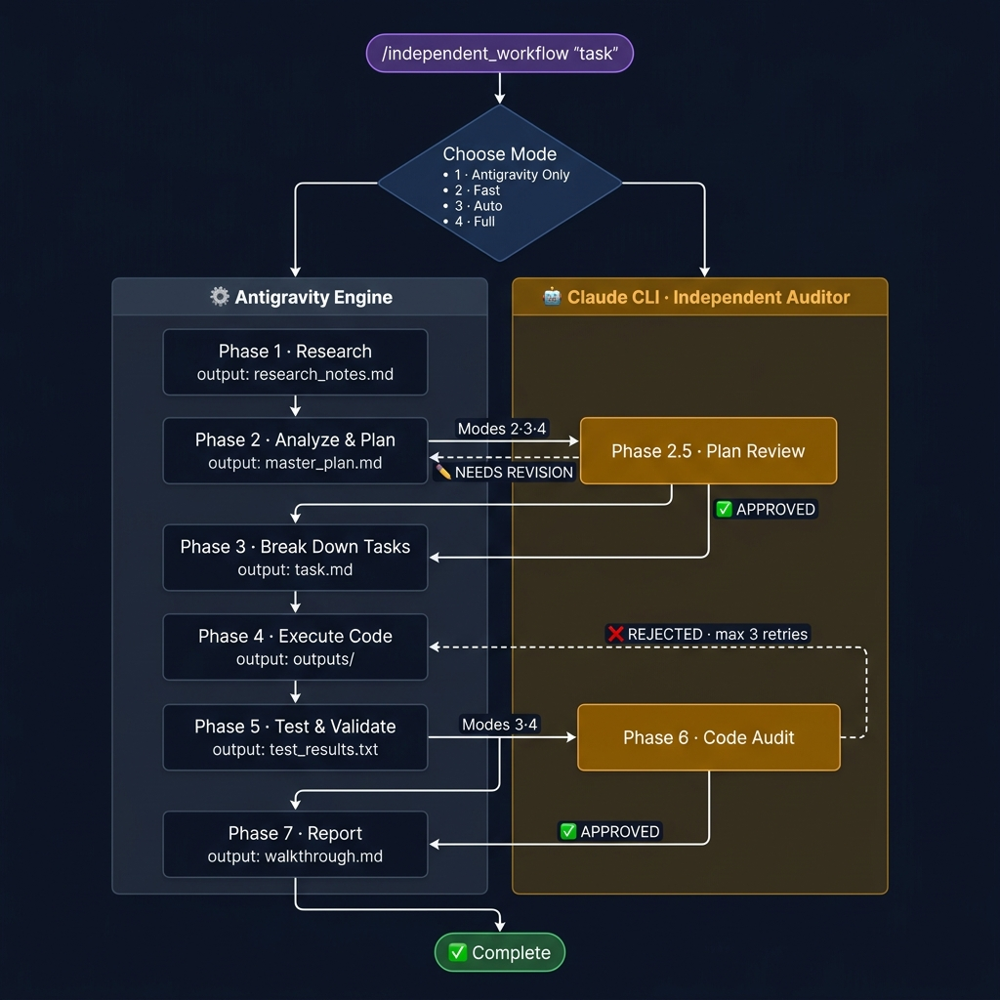
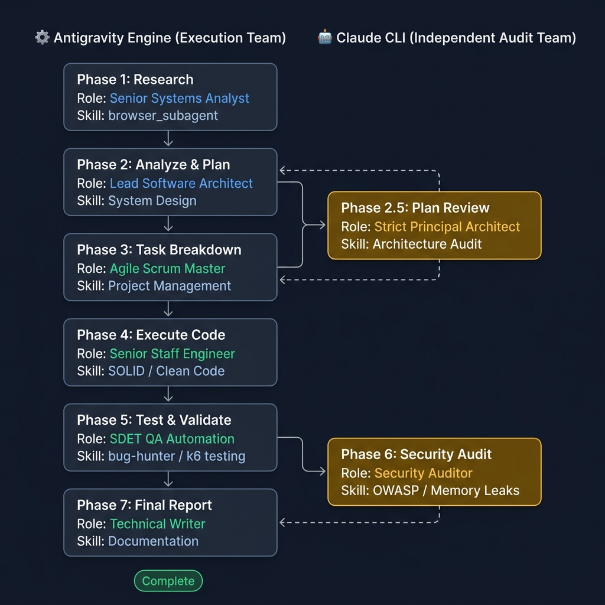

# Independent AI Workflow Orchestrator (Hybrid Edition)

A fully autonomous, self-correcting multi-agent software development workflow powered by **Antigravity IDE (Worker)** + **Claude CLI (Advisor)** as an independent auditor and dynamic expert.

---

## Quick Start

```
@hybrid-workflow "Describe your task here..."
```

---

## Execution Modes (Budget-Based)

At startup, you will be asked to choose one of four modes based on your API budget:

| # | Mode | Plan Review | Debug Escalate (Phases 4/5) | Code Audit | Cost Estimate |
|---|------|:-----------:|:---------------------------:|:----------:|:--------------|
| 1 | **Local Only** | — | — | — | $0 |
| 2 | **Safe Audit** | — | — | Claude CLI ✓ | Low |
| 3 | **Dynamic Helper**| — | Claude CLI ✓ (Max 3/task)| Claude CLI ✓ | Medium |
| 4 | **Max Quality** | Claude CLI ✓| Claude CLI ✓ (Max 3/task)| Claude CLI ✓ | High |

---

## Workflow Phases

```text
PHASE 1 ──────────────────────────────────────────────────────
  Research
  Agent  : Antigravity
  Output : research_notes.md

PHASE 2 ──────────────────────────────────────────────────────
  Analyze & Plan
  Agent  : Antigravity
  Output : master_plan.md

PHASE 2.5 (Mode 4 only) ──────────────────────────────────────
  Plan Review
  Agent  : Claude CLI ← independent advisor
  Logic  : APPROVED → continue │ NEEDS REVISION → loop back to Phase 2

PHASE 3 ──────────────────────────────────────────────────────
  Break Down Tasks
  Agent  : Antigravity
  Output : task.md

PHASE 4 & 5 ──────────────────────────────────────────────────
  Execute Code, Test & Validate
  Agent  : Antigravity
  Logic  : Write code -> Run tests
  Escalate (Modes 3, 4): If tests fail > 2 times -> Call Claude CLI (Debug Mode) 
                         context-compressed -> Fix code -> Loop (Max 3 limits)
  Output : outputs/ (source files) & test_results.txt

PHASE 6 (Modes 2, 3, 4 only) ─────────────────────────────────
  Code Audit
  Agent  : Claude CLI ← independent auditor
  Logic  : APPROVED → continue │ REJECTED → loop back to Phase 4
  Limit  : max 3 retries
  Output : feedback_report.md (on rejection)

PHASE 7 ──────────────────────────────────────────────────────
  Report
  Agent  : Antigravity
  Output : walkthrough.md & advisor_log.md
```

## Workflow Architecture



## Team Roles & Personas



---

## Output Directory Layout

Each run gets its own isolated folder:

```
runs/
└── run_YYYYMMDD_HHMMSS/
    ├── research_notes.md     # Phase 1 — research findings
    ├── master_plan.md        # Phase 2 — architecture blueprint (Claude-approved)
    ├── task.md               # Phase 3 — execution checklist
    ├── outputs/              # Phase 4 — generated source code
    ├── test_results.txt      # Phase 5 — test logs
    ├── advisor_log.md        # Phase 4/5 — logs of all dynamic debug calls to Advisor
    ├── feedback_report.md    # Phase 6 — Claude defect report (if rejected)
    └── walkthrough.md        # Phase 7 — final summary report
```

> The `archive_python_script/` directory contains the legacy standalone Python CLI version, preserved for reference.
