# Hybrid AI Workflow (Worker x Advisor)

A fully autonomous, self-correcting multi-agent software development workflow powered by **Antigravity IDE (Worker)** + **Claude CLI (Advisor)**. 

Unlike traditional static workflows, this Hybrid version features **Dynamic Delegation**: the Worker can proactively escalate complex bugs to the Expert Advisor, with strict token-compression and budget limits to optimize API costs.

---

## Quick Start

```
@hybrid-workflow "Describe your task here..."
```

---

## Execution Modes (Budget-Based)

At startup, you will be asked to choose one of four modes based on your API budget:

| # | Mode | Plan Review | Debug Escalate (Phase 4/5) | Code Audit | Cost |
|---|------|:-----------:|:----------:|:----------:|:----------:|
| 1 | **Cày cuốc ($0)** | — | — | — | $0 |
| 2 | **Chốt sổ an toàn** | — | — | Claude CLI ✓ | Low |
| 3 | **Trợ thủ đắc lực** | — | Claude CLI ✓ (Max 3) | Claude CLI ✓ | Medium |
| 4 | **Đại gia (Max)** | Claude CLI ✓ | Claude CLI ✓ (Max 3) | Claude CLI ✓ | High |

---

## Workflow Architecture Diagram

```mermaid
sequenceDiagram
    participant User
    participant Worker as Antigravity (Worker)
    participant Advisor as Claude CLI (Advisor)

    User->>Worker: @hybrid-workflow [Task]
    Worker->>User: Prompt for Mode (1-4)
    User-->>Worker: Selects Mode
    
    rect rgb(30, 40, 50)
        Note over Worker: Phase 1: Research
        Worker->>Worker: Generate research_notes.md
    end

    rect rgb(30, 40, 50)
        Note over Worker,Advisor: Phase 2: Analyze & Plan
        Worker->>Worker: Generate master_plan.md
        opt If Mode 4
            Worker->>Advisor: call_advisor.py --mode architect
            Advisor-->>Worker: Architecture Feedback
            Worker->>Worker: Revise master_plan.md
        end
    end

    rect rgb(30, 40, 50)
        Note over Worker: Phase 3: Task Breakdown
        Worker->>Worker: Generate task.md
    end

    rect rgb(30, 40, 50)
        Note over Worker,Advisor: Phase 4 & 5: Execute, Test & Debug
        loop Task Implementation
            Worker->>Worker: Write Code & Run Tests
            alt Test Fails > 2 times & Mode >= 3
                Worker->>Advisor: call_advisor.py --mode debug (Context Compressed)
                Advisor-->>Worker: Root Cause & Fix Guide
                Worker->>Worker: Apply Fix
            end
        end
    end

    rect rgb(30, 40, 50)
        Note over Worker,Advisor: Phase 6: Code Audit
        opt If Mode >= 2
            Worker->>Advisor: call_advisor.py --mode audit
            Advisor-->>Worker: STATUS: APPROVED / REJECTED
            opt If REJECTED
                Worker->>Worker: Loop back to Phase 4 (Max 3 times)
            end
        end
    end

    rect rgb(30, 40, 50)
        Note over Worker: Phase 7: Report
        Worker->>Worker: Generate walkthrough.md & advisor_log.md
    end
    
    Worker->>User: Task Completed
```



---

## Workflow Phases Details

- **PHASE 1: Research (Analyst):** Understand requirements and libraries. Output: `research_notes.md`.
- **PHASE 2: Analyze & Plan (Architect):** Blueprint the logic. Output: `master_plan.md`. (Mode 4: Gets reviewed by Advisor).
- **PHASE 3: Break Down Tasks (Scrum Master):** Granular checklist. Output: `task.md`.
- **PHASE 4: Execute Code (Staff Engineer):** Write source code. Output: `outputs/` folder.
- **PHASE 5: Test & Validate (SDET):** Write & run tests. Output: `test_results.txt`.
  - **Dynamic Escalation:** If Phase 4/5 fails > 2 times, the Worker automatically runs `call_advisor.py --mode debug` to get help from Claude CLI (Max 3 times per run).
- **PHASE 6: Code Audit (Auditor):** Final review by Claude CLI. Output: `feedback_report.md` (if rejected). Loops to Phase 4.
- **PHASE 7: Report (Technical Writer):** Final summary. Output: `walkthrough.md`.

---

## Output Directory Layout

Each run gets its own isolated folder:

```
runs/
└── run_YYYYMMDD_HHMMSS/
    ├── research_notes.md     # Phase 1 — research findings
    ├── master_plan.md        # Phase 2 — architecture blueprint
    ├── task.md               # Phase 3 — execution checklist
    ├── outputs/              # Phase 4 — generated source code
    ├── test_results.txt      # Phase 5 — test logs
    ├── advisor_log.md        # Phase 4/5 — logs of all dynamic debug calls to Advisor
    ├── feedback_report.md    # Phase 6 — Claude defect report (if rejected)
    └── walkthrough.md        # Phase 7 — final summary report
```
